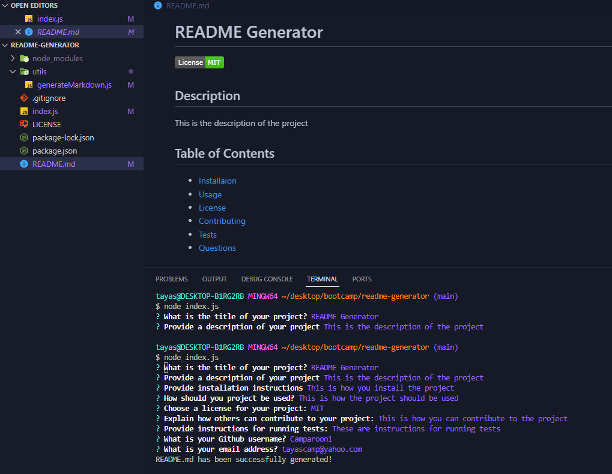

# README Generator

  

  ## Description
  The purpose of this application is to assist creators in quickly and easily generating professional README.md files for their projects, directly from the command line.

  

  ## Table of Contents
  - [Installation](#installation)
  - [Usage](#usage)
  - [License](#license)
  - [Contributing](#contributing)
  - [Tests](#tests)
  - [Questions](#questions)

  ## Installation
  To run this code, you can clone the files from the README Generator repository and open them in your code editor. Make sure that Node.js is instaled with the inquire npm package and you can intialize the README Generator prompts in the commandline  with  command `node index.js`

  ## Usage 
  After navigating to the index.js file within the command line and running `node index.js`, the user will be prompted with series of questions including the name of the project,  its description, installation, usage contribution and test details, preferred licensing, as well as the creators GitHub and Email

A video walkthrough can be found [Here](https://drive.google.com/file/d/182ydpwyUGQl3odi2mrwCEHqeyjKiBZFS/view)

  ## License
    This project is licensed under the MIT License.

  ## Contributing 
  

  ## Tests
  

  ## Questions
  If you have any questions, please contact [Camparooni](https://github.com/Camparooni) on GitHub or email at Tayascamp@yahoo.com.

